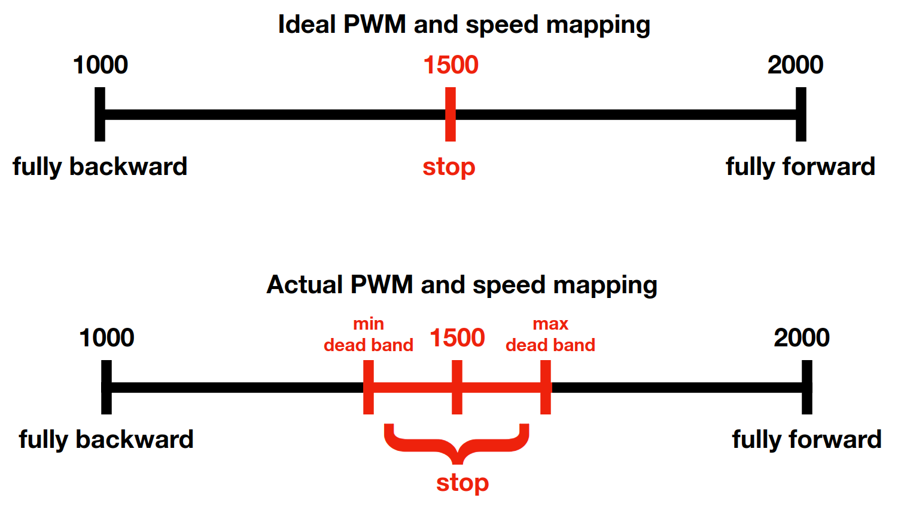
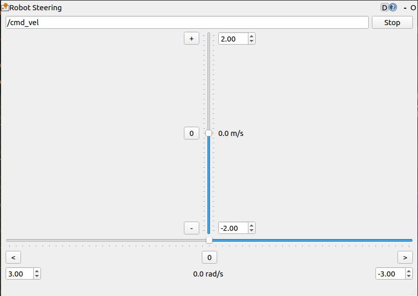

# AT_MOTOR-DRIVER_100A_2ch Ver.9.0 ROS2 Utilities

This package is a helper to use motor driver in ROS2.

## Dependencies

- [ROS1 noetic](http://wiki.ros.org/noetic/Installation/Ubuntu)
- [ROS2 galactic](https://docs.ros.org/en/galactic/Installation/Ubuntu-Install-Debians.html)
- rosserial_python `sudo apt install ros-noetic-rosserial-python`
- [ros1_bridge](https://github.com/ros2/ros1_bridge), change to `galactic` branch
- make sure the user can access serial port `sudo usermod -a -G dialout $USER`
- clone and build this package
	```
	cd ~/dev_ws/src/
	git clone https://github.com/attraclab/md100a_ros2_utils.git
	cd ~/dev_ws
	colcon build --symlink-install --packages-select md100a_ros2_utils
	source ~/dev_ws/install/local_setup.bash
	```

## Setup

It is recommended to put general ROS env paramters i.e. ROS_MASTER_URI and etc. on .bashrc so every terminals will have the same of this.

### Firmwares

As default, output ROS topics with the namespace as `/md100a/...`, all of the firmware is stored at [firmwares folder](./firmwares), please check on the listed firmware below and description,

### Robot computer (remote)

login to robot computer and put these lines below on .bashrc file

```
## for ROS1
export ROS_MASTER_URI=http://localhost:11311
export ROS_IP=192.168.8.198
export ROS_HOSTNAME=$ROS_IP

## for ROS2
export ROS_DOMAIN_ID=1
```

make sure to change ip address on `ROS_IP` to the Robot's IP.

### Your computer (host)
```
## for ROS1
export ROS_MASTER_URI=http://192.168.8.198:11311
export ROS_IP=192.168.8.113
export ROS_HOSTNAME=$ROS_IP

## for ROS2
export ROS_DOMAIN_ID=1
```

make sure to change `ROS_MASTER_URI` to robot's ip, and `ROS_IP` to your computer ip.

`ROS_DOMAIN_ID` of both robot and your computers must be same in order to let it see each other.

### Source env

We need to source ROS enviroment according to which ROS version/package we would like to run.

When sourcing ROS1 env, we need to run the following lines before the package
```sh
source /opt/ros/noetic/setup.bash
source ~/catkin_ws/devel/setup.bash
```
this is assume your ROS1 workspace is `catkin_ws`.

When sourcing ROS2 env, we need to run the following lines before the package
```sh
source /opt/ros/galactic/setup.bash
source ~/dev_ws/install/local_setup.bash
```
this is assume your ROS2 workspace is `dev_ws`.

### udev rules

It's better to setup the udev-rules to avoid USB devices conflicts.

```sh
sudo cp ~/dev_ws/src/md100a_ros2_utils/udev_rules/99-md100a.rules /etc/udev/rules.d/
sudo udevadm control --reload-rules
sudo udevadm trigger
## try unplug and plug back the usb port
ls /dev/
## you should be able to see /dev/md100a
```

## Understand Topics and Node

Before running this on ROS2, we better to understand what each topic is doing first. We can try this on ROS1 by running these following command.

```sh
# Terminal 1
# source ROS1 env
roscore

## Terminal 2
# source ROS1 env
rosrun rosserial_python serial_node.py  _port:=/dev/md100a _baud:=921600
# you can only use /dev/md100a if you've done setup udev rules from Setup step above. 
```

All of topics are in standard or existing message type, please check the following,

### Publish

- `/md100a/cart_mode` as std_msgs/Int8; this is cart mode, 0: hold, 1: manual, 2: auto. And it's reflected from ch5 of RC transmitter. When the RC transmitter is turned off, the mode will be changed to 2 automatically.
- `/md100a/sbus_rc_ch` as std_msgs/Int16MultiArray; this is array of sbus value from RC transmitter's channels.
- `/md100a/imu` as sensor_msgs/Imu; this is IMU data if motor driver recognized BNO055 on GROVE_I2C port.


### Subscribe

- `/md100a/cart_mode_cmd` as std_msgs/UInt8; we can change cart mode programmatically from this topic, 0: hold, 1: manual, 2: auto.
- `/md100a/pwm_cmd` as std_msgs/Int16MultiArray;  we can send PWM value of left/right wheels as [left_pwm, right_pwm], the range is **1000-1500-2000**.
- `/md100a/pwm_out` as std_msgs/Int16MultiArray; this topic depends on the firmware on ESC. If the firmware is *20231117c_AT_MOTOR-DRIVER_100A_2ch_ver9_PWMOUT.hex* then you could see this. We can send PWM extra output on PWM1, PWM2, and PWM3 ports to drive servo or any PWM driven devices, the value is [PWM1, PWM2, PWM3], the range is **1000-1500-2000**.

### Node

- `cmd_vel_converter.py` is to convert general `/cmd_vel` topic to `/md100a/pwm_cmd`, because this driver has no feedback or direct control of wheel speed, so we just estimate the maximum vx as 2 m/s as the max PWM 2000, also in the other side -2 m/s as min PWM 1000.

## Run

```sh
## Terminal 1
## source ROS1 env
roscore

## Terminal 2
## source ROS1 env then ROS2 env
ros2 run ros1_bridge dynamic_bridge

## Termianl 3
## source ROS1 env
rosrun rosserial_python serial_node.py  _port:=/dev/zmoab _baud:=921600

## Terminal 4
## source ROS2 env
## this is to convert cmd_vel to /md100a/pwm_cmd topic
ros2 run md100a_ros2_utils cmd_vel_converter
``` 

## PWM offset

Before using we need to find the lowest speed which the left/right wheels starts to spin in both forward and reverse direction. Because there is a **dead-band** on PWM range where the wheel couldn't spin in that range. It's somewhere near 1500 value (the middle).




First start the node as above Run's terminal.

Then run `ros2 run rqt_robot_steering rqt_robot_steering` on another terminal.



Move the vertical bar (linear velocity) up slowly, make sure the RC is in auto mode or you can turn it off.

Observe the wheel when it starts rotating and look on the `cmd_vel_conveter` terminal. The left and right wheels can have different value, so put that number to `pwm_left_max_db` and `pwm_right_max_db` on [pwm_params.yaml](./config/pwm_params.yaml) file.

Similarly, move the linear velocity down slowly and observe the wheels again. Once you see the wheel starts to spin reverse then put that numbers to `pwm_left_min_db` and `pwm_right_min_db` on [pwm_params.yaml](./config/pwm_params.yaml)  file.

We can terminate the `cmd_vel_converter` and run it again with this command 

`ros2 run md100a_ros2_utils  cmd_vel_converter --ros-args --params-file ~/dev_ws/src/md100a_ros2_utils/config/pwm_params.yaml`

If you move the linear velocity slightly, you should notice the wheel starts rotating immediately.

